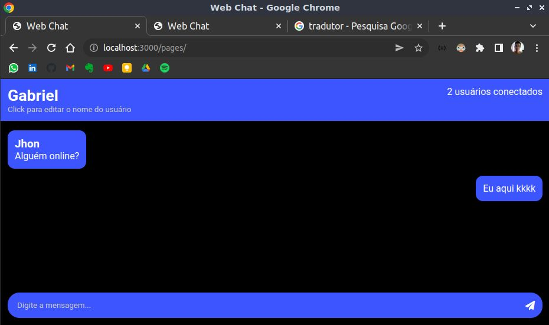

# [Web Chat](https://br-chat.herokuapp.com/pages)

<div align="center">
    
</div>

## 🔎 Sobre
Uma aplicação de mensagens em tempo real.

## 🤔 Porquê?
Fiz este projeto com o intuito de praticar e demonstrar minhas habilidades com o protocolo web socket que é utilizado para fazer aplicações que necessitam manter uma conexão fixa com servido. O meu foco neste projeto foi o backend.

## 🧰 Tecnologias usadas
- Nodejs
- Nestjs

## 🏃 Rodando o projeto

### Pré requisitos
- Git
- Docker
- Docker compose

### 1. Clonando o projeto
```
git clone https://github.com/gabrielssprog/web-chat.git
cd web-chat
```

### 2. Subindo containers do Docker
```
docker-compose up
```

### 3. Acessando a aplicação
Agora acesse pelo navegar o link `https://localhost:3001/pages` para acessar a interface da aplicação.
